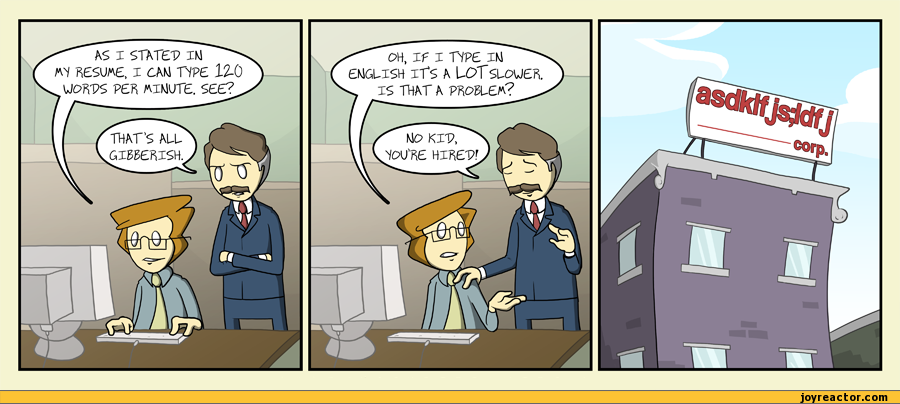

# So You Think You Can Type? "Typr"
======

## Landing Page
* A blank page with a huge input bar (to accept user input). This is what the user will see when the game starts.
* From there a list of simple directions will pop up and be dismissed by a user click
* There will be a timer on the page aswell
* Also want to display a virtual keyboard that logs your strokes as you type
   * or in the input bar key strokes will be shown 

## Game Play
* User has 2 minutes to type the words on the screen in the order they appear
* Miss spelled words/letters subtract points
* Correctly spelled words will grant additional points
* There will be a way to store high scores and detailed stats
* Background colors will also randomly change to attempt to distract users
* User will be told how many words they would need to type correctly

## Stats
* Average typing speed
* Number of correct words typed
* Incorrectly typed words

## How To Win
* Correctly match all the words on the screen
* Speed matters for high score/user satisfaction. The faster you finish the better your score.
* You will get a bonus for finishing fast

## Reset
* Press ESC to quit the game/reset the game