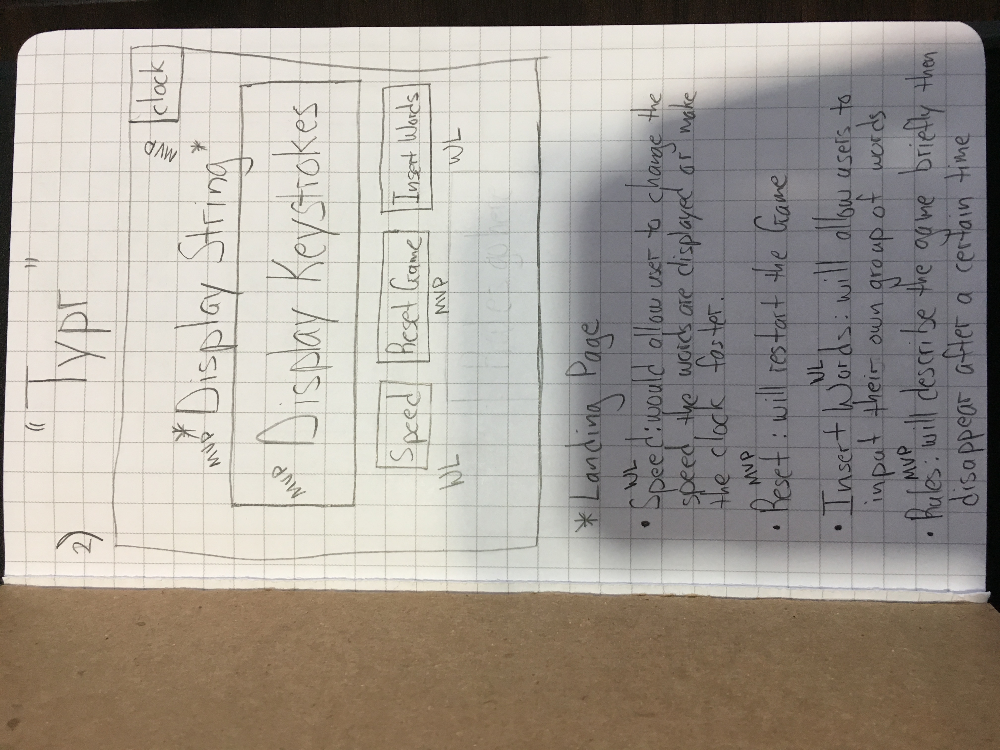
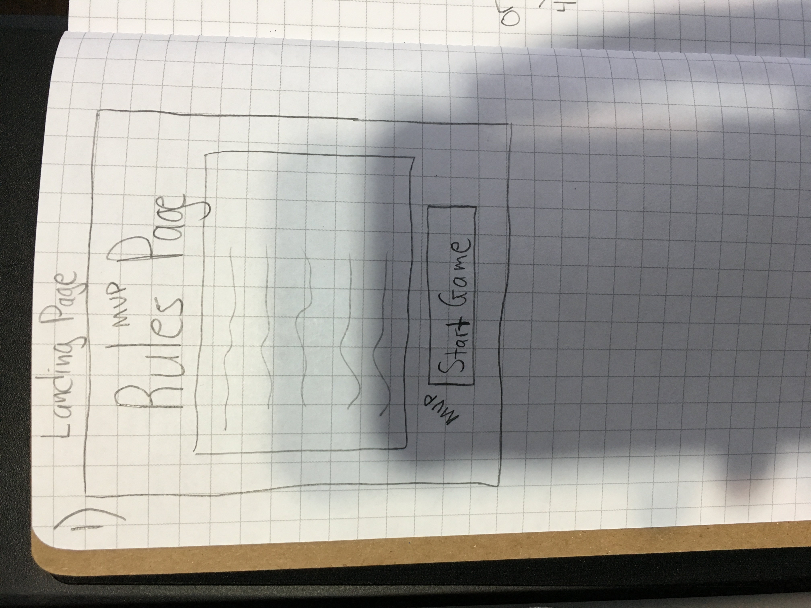
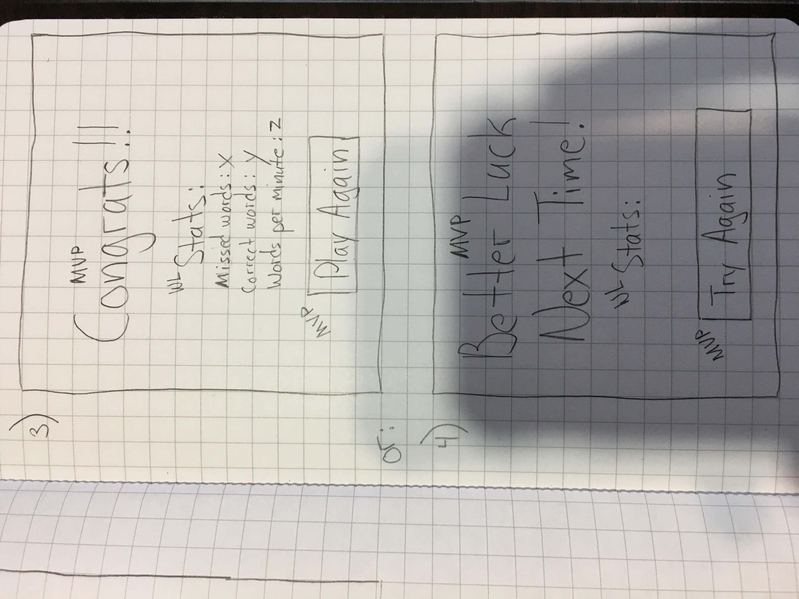

# "Typr" Typing Game

## Technologies Used
* HTML/CSS
   * Used HTML as the framework of the website and CSS to style HTML elements.
* JavaScript
   * Used to grab DOM elements and the game logic.
* JQuery
   * Used specifically to toggle the instructions button and document on load events.

## Approach Taken
1. Build an array with strings.
   * word.js
2. Pick a random word from array.
   * word.js
   * Used Math.random() to generate a random number between 0 and the Array length.
3. Using String.split() to split the string into an array so each letter has an index.
   * word.js
   * Each letter can now be compared, to the keyboard stroke.
4. Use a keyboard event to compare to the split array's index.
   * main.js

## Wireframes

## How To Use Instructions
1. Click the Instructions button: to toggle the instructions
2. Click Start Game to begin the game
3. Once game starts, a timer, a word and your score will appear
4. You then have 60 seconds to type as many words correctly as possible
5. Once the time expires, you will get a final score
6. Final score represents how many correctly typed words were typed

## User Stories
1. As a user, I want to play Typr
2. I see three buttons
   * Start Game, begins the game and a random word is displayed
   * Reset Game, reloads the game
   * Instructions, toggles the instructions
3. When Game starts, user has to type the displayed words
4. When the timer hits 0, the game is over.